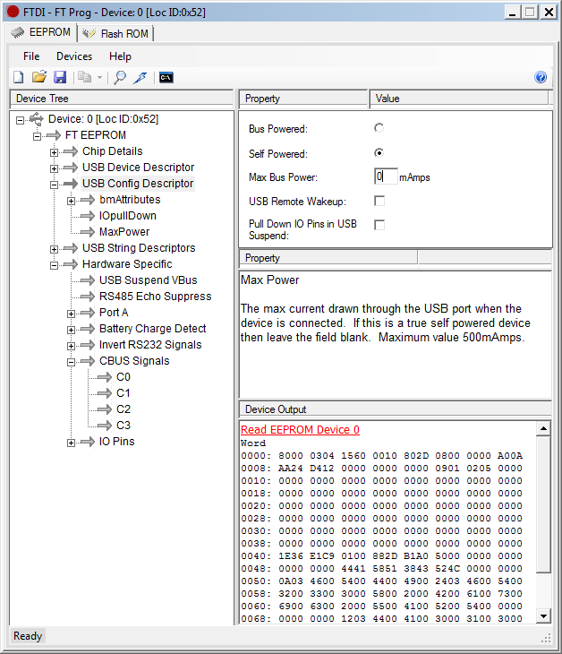
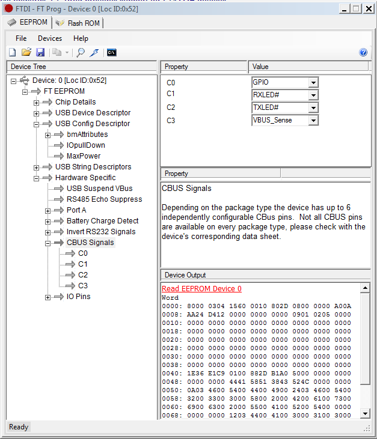
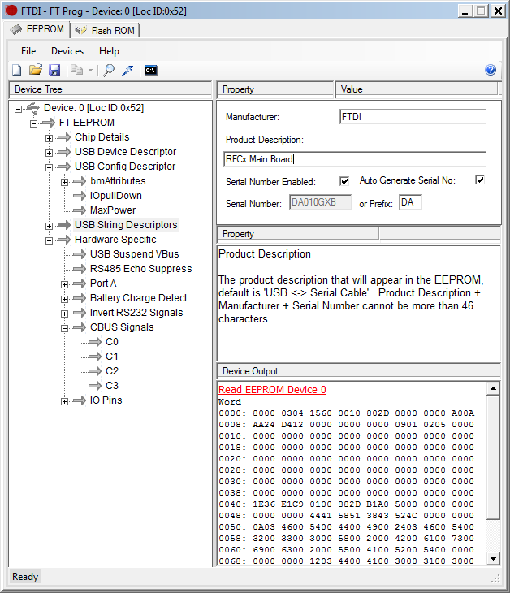
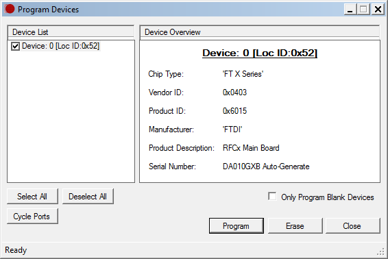

#RFCx Microcontroller Software
@gibsjose, @Jesse-Millwood, @gaberex, @topherwhite
###8 July 2015

##Description
This is the code for the ATmega328P microcontroller on the RFCx board responsible for taking temperature, humidity, and power measurements and sending them to the Guardian App for display and/or transmission.

##Setup
In theory, you can use any operating system to build. However, we have tested and recommend using **Ubuntu Linux 12.04+**. We used 14.04 for most of the development. We have also got things working on Windows using `cygwin` and `winavr`. There is a very small bug on OS X that must be corrected, but it is almost entirely working on OS X too.

The following steps are required to configure the board:
1. Install the required packages/software
2. Configure the environment
3. Configure the AVRISP mkII (Optional)
4. Configure the FTDI chip (**NOT** Optional)

After configuring the board, you can then proceed with building the project and programming the board.

###Required Packages
To build the software and program the microcontroller, you must have the `avrdude` and `avr-gcc` packages installed (in addition to standard tools like `make`).

>**NOTE:** On any of the operating systems, an install of the Arduino IDE ([https://www.arduino.cc/en/main/software](https://www.arduino.cc/en/main/software)) will include all of the command line tools necessary, but they may be in strange locations. You can always just make symbolic links to your desired directories, though.

####Ubuntu
On Ubuntu (or any Debian-based version of Linux):
```bash
sudo apt-get install avr-gcc
```
```bash
sudo apt-get install avrdude
```

####Windows
On Windows install `WinAVR` ([winavr.sourceforge.net/](http://winavr.sourceforge.net/)) and use `cygwin` to emulate a Terminal ([www.cygwin.com/](https://www.cygwin.com/)).

####OS X
On OS X, install Homebrew ([http://brew.sh/](http://brew.sh/)) or your favorite package manager:
```bash
brew tap osx-cross/avr
brew install avr-libc
```
```bash
brew install avrdude
```

###Configure the Environment
Next you need to set up a few environmental variables:
```bash
export RFCX_PROGRAMMER=avrispmkII
export RFCX_PORT=usb
```

1. `RFCX_PROGRAMMER` is either `avrispmkII` for the AVRISP mkII (for programming the actual board), or `arduino` if you are using an Arduino Uno to debug something. `RFCX_PROGRAMMER` defaults to `avrispmkII` if not set using `export`.

2. `RFCX_PORT` is the `/dev/...` file for your configuration. If no `/dev/ttyXXX` file exists, try `export RFCX_PORT=usb` if you are using the AVRISP mkII. If you are using the Arduino, it may show up as something like `/dev/ttyACM0` on OS X and Linux, or `com5` on Windows. `RFCX_PORT` defaults to `usb` if not set using `export`.

###Oscillator Setup
There are two make commands: `make setup_1MHz` and `make setup_8MHz` that will set the microcontroller's internal oscillator to either 1MHz or 8MHz. With a fresh batch of chips from the factory, the default is to use the divide-by-eight clock divider, which will therefore use the 1MHz clock. The default fuses corresponding to the 1MHz clock are `(H:07, E:D9, L:62)`.

Running the 8MHz setup (`make setup_8MHz`) only changes the low fuse to remove the default divide-by-eight clock divider. This allow us to run at the higher speed, if needed.

This is semi-optional because we don't *really* need to run at 8MHz. During testing we have been using 8MHz, but there is no reason we couldn't run at 1MHz or lower.

If you decide not to run any `make setup_...` or run `make setup_1MHz`, which will then use the 1MHz clock, remember to modify the `F_CPU` macro in [rfcx_mcu.h](./rfcx_mcu.h) to reflect the correct clock speed.

###AVRISP mkII Setup
See below if you are using the AVRISP mkII on Ubuntu (the recommended setup). You may try to use the programmer without first configuring it as described below, but if you run into issues then please consult the instructions on setting up the programmer at the end of this document.

###FTDI Setup
**IMPORTANT:** You must configure each FTDI chip by flashing it over USB using a program called FT Prog ([http://www.ftdichip.com/Support/Utilities.htm#FT_PROG](http://www.ftdichip.com/Support/Utilities.htm#FT_PROG)). **See the very end of this document for instructions on how to program the FTDI chips.**

##Build
Once everything has been configured, perform the following steps:

1. Plug in the AVRISP mkII to a USB port on the computer and connect the other end to the ICSP header on the board.
> **NOTE:** **Pin 1** of the header on the board is denoted by a small white hatch, separate from the rest of the outline on the board. **Pin 1** on the AVRISP mkII connector is denoted by the side with the **red** stripe on the cable.

2. Ensure that the board is powered (it will not receive power from the AVRISP mkII programmer).

3. Build the project:
```bash
make
```

4. Program the board:
```bash
make program
```
> **NOTE:** You will want to use `make clean` between subsequent builds.

##AVRISP mkII Configuration
To configure the AVRISP mkII on Ubuntu, the following extra steps need to be taken. The steps are also outlined [here](http://stackoverflow.com/questions/5412727/avrisp-mkii-doesnt-work-with-avrdude-in-linux).

###Create a new `udev` rules file:
```bash
cd /etc/udev/
sudo touch avrisp.rules
```
The file should contain the following:

```bash
SUBSYSTEM!="usb_device", ACTION!="add", GOTO="avrisp_end"

# Atmel Corp. JTAG ICE mkII
ATTR{idVendor}=="03eb", ATTR{idProduct}=="2103", MODE="660", GROUP="dialout"
# Atmel Corp. AVRISP mkII
ATTR{idVendor}=="03eb", ATTR{idProduct}=="2104", MODE="660", GROUP="dialout"
# Atmel Corp. Dragon
ATTR{idVendor}=="03eb", ATTR{idProduct}=="2107", MODE="660", GROUP="dialout"

LABEL="avrisp_end"
```

Next, create a hard link for the file:
```bash
cd /etc/udev/rules.d/
ln ../avrisp.rules 60-avrisp.rules
```
<br>

###Add yourself to the `dialout` group
```bash
usermod -a -G dialout $USER
```

###Restart the `udev` service
```bash
sudo service udev restart
sudo udevadm control --reload-rules; udevadm trigger
```

And finally restart the computer
```bash
sudo reboot
```

###Getting information about the device
There are a number of different ways to gain information about the device:

To see the device vendor ID and device ID after plugging it in:
```bash
dmesg | tail
```

Very detailed information about the device (vendorID:deviceID):
```bash
lsusb -v -d 03eb:2104
```
* `03eb` is the vendor ID for Atmel
* `2104` is the device ID for the AVRISP mkII

##FTDI Configuration
The FTDI chips must be individually configured, as the factory defaults do not allow us to have the setup we need for this project.

The following materials are necessary to configure the FTDI chips:
1. The main board **with** a battery connected
2. A USB male-male cable. We whipped up our own, but you can also buy one [here](http://www.amazon.com/C2G-Cables-54170-Cable-Black/dp/B003VTZ070/).

Proceed through the following steps to configure the chips:

1. Download FT Prog at ([http://www.ftdichip.com/Support/Utilities.htm#FT_PROG](http://www.ftdichip.com/Support/Utilities.htm#FT_PROG)) (**Windows Only**)
2. Open FT Prog and connect the USB male-male cable from the computer to the board's USB port
3. Select `Devices` > `Scan and Parse` (the magnifying glass icon)
4. Verify that you can see the device in the panel on the left hand side
5. Proceed by either using the [template provided](./ftdi/rfcx_ftdi.xml) or manually configuring it:

###Using the Template
1. `File` > `Open Template` and select `./ftdi/rfcx_ftdi.xml`
2. Right click the device in the device tree and select `Apply Template` > `Template: rfcx_ftdi.xml`

###Manual Configuration
1. Configure the USB Descriptor:
    1. Change from `Bus Powered` to `Self Powered`
    2. Change `Max Bus Power` to `0 mAmps`

    
2. Configure the CBUS Signals (under `Hardware Specific`)
    1. `C0 -> GPIO`
    2. `C1 -> RXLED#`
    3. `C2 -> TXLED#`
    4. `C3 -> VBUS_Sense`

    
3. Configure the USB String Descriptors
    1. Product Description: `RFCx Main Board`

    
4. Program the Chip
    1. `Devices` > `Program` (Lightning bolt icon)
    2. `Program`

    
